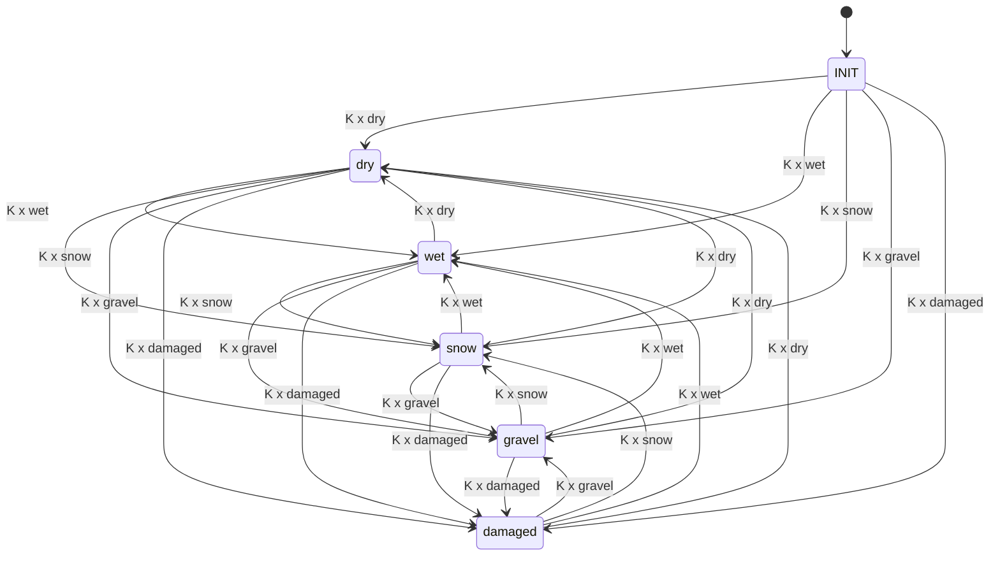

```mermaid
stateDiagram-v2
    [*] --> INIT
    INIT --> dry: K x dry
    INIT --> wet: K x wet
    INIT --> snow: K x snow
    INIT --> gravel: K x gravel
    INIT --> damaged: K x damaged
    dry --> wet: K x wet
    dry --> snow: K x snow
    dry --> gravel: K x gravel
    dry --> damaged: K x damaged
    wet --> dry: K x dry
    wet --> snow: K x snow
    wet --> gravel: K x gravel
    wet --> damaged: K x damaged
    snow --> dry: K x dry
    snow --> wet: K x wet
    snow --> gravel: K x gravel
    snow --> damaged: K x damaged
    gravel --> dry: K x dry
    gravel --> wet: K x wet
    gravel --> snow: K x snow
    gravel --> damaged: K x damaged
    damaged --> dry: K x dry
    damaged --> wet: K x wet
    damaged --> snow: K x snow
    damaged --> gravel: K x gravel
```
